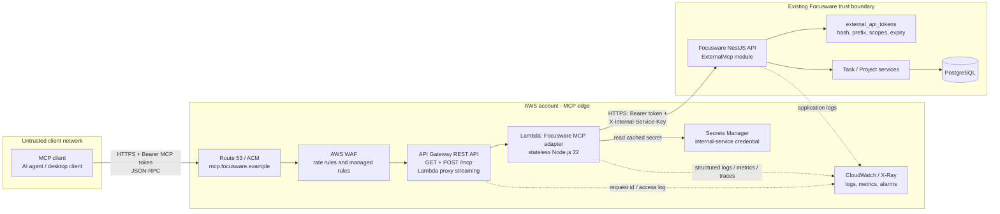

# Focusware AWS Lambda MCP Architecture Proposal

**Project:** Focusware (Focus Bear backend) MCP server  
**Document status:** Draft for client and engineering review  
**Prepared by:** Focus Bear Engineering  
**Date:** 11 September 2026  
**Decision requested:** Approve the recommended Lambda adapter architecture and the production-hardening backlog before implementation.

## 1. Executive summary and recommendation

Focusware needs a remotely reachable Model Context Protocol (MCP) server so an authorised AI client can operate on work that a Focusware user has explicitly assigned to that agent. The repository already contains the core backend capability: an `external-mcp` NestJS module, one-time scoped token issuance, token hashing, token-to-agent assignment on `to_do`, and task APIs limited to the authenticated token's assigned tasks. It also contains a separate `apps/mcp-server` NestJS prototype and a Lambda simulator.

The recommended production design is a **stateless AWS Lambda MCP adapter** fronted by **Amazon API Gateway REST API** at one public `POST /mcp` and `GET /mcp` endpoint. The adapter implements current MCP Streamable HTTP, translates MCP tool calls into calls to the existing Focusware MCP task APIs, and returns MCP JSON-RPC responses. It holds no user data and opens no direct database connection. The existing Focusware API remains the authority for token validity, scopes, user identity, task ownership, agent assignment, and persistence.

API Gateway REST API is recommended for the first production release because Lambda response streaming is available through its proxy integration. That permits compliant Streamable HTTP responses and optional SSE without creating a persistent connection service. If the chosen MCP clients only need buffered JSON responses, an HTTP API is a valid lower-cost variant; it must not be selected merely by default if response streaming is an acceptance requirement. AWS documents response streaming configuration for REST API proxy integrations, while HTTP APIs are the lightweight, lower-latency API Gateway family. [AWS response streaming](https://docs.aws.amazon.com/apigateway/latest/developerguide/response-streaming-lambda-configure.html) [AWS API Gateway and Lambda](https://docs.aws.amazon.com/lambda/latest/dg/services-apigateway.html)

This design deliberately does **not** introduce a second identity database, direct Lambda-to-PostgreSQL access, Redis, SQS, ECS, or a new OAuth provider for v1. Those additions would increase integration and operational complexity without helping the synchronous task tools in scope.

### 1.1 Decision summary

| Decision | Recommendation | Reason |
|---|---|---|
| Public entry point | API Gateway REST API, regional custom domain, `POST /mcp` and `GET /mcp` | Supports the required single MCP endpoint and Lambda response streaming where needed. |
| Compute | One Node.js 22 Lambda function, initially deployed as a Lambda container image | Fits the existing NestJS prototype; isolated, autoscaling, no server administration. |
| MCP transport | Streamable HTTP; optional SSE only when the client requests it | Current MCP transport replaces the earlier HTTP+SSE transport and supports POST/GET at one endpoint. |
| User authorisation | Existing opaque Focusware MCP bearer token is forwarded to the Focusware API | Preserves the API's existing hashed token, scope, user and token-id checks. |
| Service trust | Separate, rotated `X-Internal-Service-Key` from AWS Secrets Manager; use mTLS or private connectivity later if both services run in AWS | Adds service-to-service proof without exposing database credentials to Lambda. |
| Data access | Lambda calls Focusware HTTPS APIs only | Keeps NestJS services, TypeORM, encryption and audit behaviour authoritative. |
| Initial tool set | List tasks, get task, update task status, add task note, ensure project status | Maps to repository APIs already designed for agent assignment. |
| Capacity protection | API Gateway throttles plus Lambda reserved concurrency and strict backend timeout | Prevents an MCP client from exhausting the existing API or database. |

## 2. Scope, outcomes and non-goals

### 2.1 In scope

The first release provides an externally reachable MCP server that allows a client holding an explicitly issued Focusware MCP token to:

- discover the Focusware task tools;
- list only tasks assigned to the token's agent;
- retrieve one assigned task;
- update the core or custom status of an assigned task;
- add a note to an assigned task; and
- idempotently ensure a project custom status exists when the user may manage that project.

It also includes request validation, token forwarding, service authentication, least-privilege AWS IAM, rate/capacity controls, logging, metrics, alarms, CI/CD and testing.

### 2.2 Explicit non-goals for v1

- Lambda does not connect directly to PostgreSQL, Redis, Bull queues, Auth0, or any Focusware internal table.
- Lambda does not issue, revoke or persist user tokens. The authenticated Focusware API owns that lifecycle.
- The server does not expose all Focusware endpoints or act as a generic REST proxy.
- The server does not maintain an in-memory user session, durable SSE connection registry, or cross-invocation state.
- OAuth 2.1 dynamic client registration and token exchange are deferred. Opaque, user-issued scoped tokens are the current repository model. HTTP MCP implementations should eventually conform to MCP authorisation guidance if OAuth interoperability becomes a client requirement. [MCP authorisation](https://modelcontextprotocol.io/specification/2025-03-26/basic/authorization)
- Long-running asynchronous work, attachment upload/download, and focus-session control are deferred.

## 3. Current Focusware architecture and implementation evidence

The proposal is intentionally based on repository code rather than a greenfield interpretation.

### 3.1 Existing backend capabilities to retain

| Existing component | Repository evidence | Responsibility retained in the target design |
|---|---|---|
| Main API | `apps/api-server`, NestJS/Fastify application | Authentication, business rules, TypeORM persistence, task and project behaviour. |
| External MCP API module | `apps/api-server/src/modules/external-mcp_fffff/` re-exported by `external-mcp/` | Token lifecycle, bearer-token validation, scopes, task endpoint controllers. |
| Token store | `external_api_tokens` migration/entity/repository | Stores only a scrypt hash, SHA-256-derived lookup prefix, scopes, expiry, label and optional `agent_name`. |
| Agent assignment | `to_do.assigned_mcp_token_id`, migration `1773025000002` | Restricts agent task visibility and writes to the authenticated token. |
| Task operations | `ExternalMcpTasksController` / `ExternalMcpTasksService` | Reads and writes after token, scope, user and assignment validation. |
| Project status creation | `ProjectRepository.ensureCustomStatus` | Idempotent project status creation under a transaction/lock. |
| MCP prototype | `apps/mcp-server` | Tool mapping and a Lambda-oriented experiment; it is not production-ready as-is. |

The existing `ExternalApiTokenGuard` validates `Authorization: Bearer <token>`, looks up token candidates by a non-secret hash prefix, verifies the scrypt hash, rejects expired/revoked credentials and puts `mcpUserId`, `mcpScopes`, and `mcpTokenId` on the request. The task service then enforces `tasks:read` or `tasks:write` and queries task records using both `user_id` and `assigned_mcp_token_id`. This is the core authorisation boundary that Lambda must preserve, not reproduce loosely.

### 3.2 Existing task API contract

All paths below are served by the existing Focusware API, not by AWS API Gateway. The adapter calls them over HTTPS using both the end-user bearer token and an internal-service credential.

| HTTP operation | Existing route | Scope | Important server-side rule |
|---|---|---|---|
| List assigned tasks | `GET /mcp/tasks` | `tasks:read` | Queries tasks by authenticated `user_id` **and** `assigned_mcp_token_id`. |
| Get one task | `GET /mcp/tasks/:id` | `tasks:read` | Returns 404 unless the task belongs to the token's user and is assigned to that token. |
| Update status | `PATCH /mcp/tasks/:id/status` | `tasks:write` | Requires `status` and/or `custom_status_id`; assignment check occurs before update. |
| Add note | `POST /mcp/tasks/:id/notes` | `tasks:write` | Assignment check occurs before creating the comment. |
| Ensure project status | `POST /mcp/tasks/project-statuses` | `tasks:write` | User must be project owner or accepted member; operation is idempotent. |
| Issue token | `POST /mcp/auth/tokens` | Focusware user session | Raw token returned once; hash is stored. |
| List/revoke tokens | `GET` / `DELETE /mcp/auth/tokens` | Focusware user session | Never returns raw tokens. |

### 3.3 Production gaps visible in the current prototype

These are acceptance items, not criticisms of the prototype:

1. `apps/mcp-server/src/mcp/services/tasks.service.ts` contains a hard-coded `dev-secret` fallback and comments that a secret should be in AWS Secrets Manager. Production code must require a secret obtained at runtime and fail closed if absent.
2. The API `InternalServiceGuard` currently also falls back to `dev-secret`. Remove every default development secret from production builds and rotate the production secret.
3. The API token issuance controller contains a fixed user ID and commented-out Auth0 guard annotations. Restore `IsAuth`, `ApiSecurity('Auth0AccessToken')`, and actual `@AuthContext()` before making token issuance reachable to clients.
4. The current Lambda entry point streams an SSE response but is coupled to an ALB-like event shape and assumes a single raw request body. Replace it with API Gateway REST proxy event handling and MCP Streamable HTTP validation.
5. The current code should never rely on process maps such as the older commented `connections` map. Lambda execution environments are ephemeral and concurrent invocations do not share reliable state.
6. Normalise the temporary `external-mcp_fffff` directory naming before or during production hardening so imports, ownership and deployment artefacts are clear.

## 4. Options considered

### 4.1 Entry and runtime options

| Option | Benefits | Constraints | Decision |
|---|---|---|---|
| Lambda Function URL | Lowest infrastructure effort; direct Lambda invocation | Fewer API-management controls; not the preferred production choice where custom domain, throttling and richer request handling are required. | Do not use for v1. |
| API Gateway HTTP API + Lambda | Low cost/latency, simple proxy and JWT/Lambda authoriser options | Use only for buffered MCP responses; it is not the selected streaming path. | Contingency for a verified non-streaming client set. |
| API Gateway REST API + Lambda response streaming | Supports proxy response streaming and API Gateway features; one public MCP endpoint | Higher unit cost and more configuration than HTTP API. | **Recommended.** |
| ALB + Lambda | Supports HTTP workloads and aligns with prototype terminology | Adds load-balancer cost/operations and does not add value for a small API surface. | Do not use for v1. |
| ECS/Fargate long-running MCP service | Familiar HTTP server lifecycle, long connections | Higher fixed cost and operational burden; unnecessary for synchronous tools. | Revisit only if persistent connection or runtime limits become a proven need. |

AWS recommends API Gateway rather than Function URLs for production workloads that need custom domains, authentication choices, throttling and richer request/response handling. [AWS invocation decision guide](https://docs.aws.amazon.com/lambda/latest/dg/apig-http-invoke-decision.html) API Gateway should have an authorisation policy on every route where one is available; in this design the backend remains the token authority until a safe token-introspection authoriser exists. [API Gateway access control](https://docs.aws.amazon.com/apigateway/latest/developerguide/http-api-access-control.html)

### 4.2 Authentication placement options

| Option | Assessment | Decision |
|---|---|---|
| Validate only in Lambda | Would duplicate token hashing/storage logic or call the database directly; risks divergence. | Reject. |
| API Gateway Lambda authoriser that calls the backend token store | Can reject before handler, but adds a second invocation and needs a dedicated internal introspection contract, cache/revocation policy and careful context handling. | Defer. |
| Lambda forwards bearer token; Focusware API guard validates it | Reuses the implemented source of truth and preserves `mcpTokenId` for assignment checks. Lambda sees no persistent user data. | **Recommended v1.** |
| Share the external token table with Lambda | Requires database network and credentials in Lambda; duplicates application authority. | Reject. |

The v1 adapter performs cheap syntactic checks (Bearer format, maximum size) and forwards the opaque token only to the Focusware API over TLS. It must treat a non-empty token as **unverified** until the backend returns successfully. If future load makes an authoriser valuable, add `POST /internal/mcp/token-introspection` to the Focusware API, authenticate it with a separate machine credential, return non-sensitive `user_id`, `token_id`, `scopes`, `expires_at`, and set authoriser cache TTL to zero initially. API Gateway Lambda authoriser caching can otherwise apply a cached response to all matching routes unless the route is part of the cache key. [AWS Lambda authorisers](https://docs.aws.amazon.com/apigateway/latest/developerguide/http-api-lambda-authorizer.html)

## 5. Target architecture

### 5.1 Architecture diagram



**Figure 1. Recommended architecture.** Solid arrows carry request/response data; dotted arrows carry telemetry. The public-client and existing-Focusware boundaries are distinct. The MCP token crosses into Lambda only in memory and is forwarded only to the allow-listed Focusware API origin.

### 5.2 Component responsibilities

| Component | New or existing | Responsibility | Must not do |
|---|---|---|---|
| MCP client | Existing/external | Sends JSON-RPC MCP requests; stores the one-time token securely; renders tool results. | Call the Focusware internal task APIs directly. |
| Route 53 / ACM | New AWS configuration | Resolves the dedicated MCP domain and terminates TLS with a managed certificate. | Store user credentials. |
| AWS WAF | New AWS configuration; optional in early non-production | Blocks common malicious patterns and applies IP/rate rules before API Gateway. | Decide user permissions. |
| API Gateway REST API | New AWS configuration | Accepts only `GET /mcp`, `POST /mcp`, and `OPTIONS /mcp`; applies request size, CORS/origin and stage throttles; invokes Lambda. | Know Focusware task permissions or database data. |
| Lambda MCP adapter | New deployment of existing prototype | Validates MCP envelope; maps tools to allow-listed API calls; maps errors; creates telemetry. | Persist tokens, query PostgreSQL, or become a general proxy. |
| Secrets Manager | New AWS configuration | Holds the internal-service secret (and only secrets that Lambda must use); KMS encrypts at rest; supports rotation. | Hold opaque user MCP tokens. |
| Focusware NestJS API | Existing | Validates raw MCP token, scopes, expiry and agent assignment; applies domain rules; writes data. | Trust Lambda merely because a request reached it. |
| PostgreSQL / TypeORM | Existing | Stores tokens as hashes and task/project records. | Be exposed to Lambda or the internet. |
| CloudWatch / X-Ray | New AWS configuration plus existing application logs | Retains security-safe logs, metrics, traces and alerts. | Receive raw bearer tokens or task detail content. |

### 5.3 Network and trust boundaries

- The public endpoint is `https://mcp.focusware.example/mcp`; only HTTPS/TLS 1.2+ is permitted.
- API Gateway is the sole public AWS ingress. Lambda has no Function URL and no public inbound address.
- Lambda is not placed in a VPC for v1 if the Focusware API is publicly reachable by HTTPS. This avoids unnecessary NAT gateway cost and cold-start/network complexity. If the API is private, place Lambda in private subnets with security groups and a private DNS route or PrivateLink; do not expose a database route merely to make the call work.
- Lambda egress is allow-listed to the configured Focusware API hostname. DNS, TLS validation and `MAIN_API_URL` configuration must prevent SSRF or operator-configured arbitrary destinations.
- The Focusware API requires both the end-user bearer token and `X-Internal-Service-Key`. The former answers “which user and agent may do this?”; the latter answers “is this request from the designated adapter?” Neither replaces the other.
- Lambda's execution role has only CloudWatch logging/tracing and `secretsmanager:GetSecretValue` for the one named secret (plus KMS decrypt only if a customer managed key requires it). It receives no database, Auth0-management or broad AWS credentials.

## 6. Protocol and API design

### 6.1 MCP endpoint and transport

The public server exposes one endpoint:

| Method | Path | Purpose | Content type |
|---|---|---|---|
| `POST` | `/mcp` | MCP initialise, tool listing, tool calls and client messages | `application/json` (or MCP versioned JSON media type if the selected SDK requires it) |
| `GET` | `/mcp` | Streamable HTTP notification/SSE capability or a minimal capability response as required by the selected MCP SDK | `text/event-stream` only when streaming is negotiated; otherwise JSON/error as protocol requires |
| `OPTIONS` | `/mcp` | Browser preflight only for explicitly approved web client origins | No body required |

MCP Streamable HTTP replaces the older HTTP+SSE transport. It requires a single endpoint supporting both POST and GET, and permits the server to use SSE when it needs to stream multiple messages. [MCP transports](https://modelcontextprotocol.io/specification/2025-11-25/basic/transports) The implementation must validate `Origin` whenever it is present; the specification calls this out to prevent DNS rebinding. For a public hosted service, allow only the exact approved client origins; if an approved native client sends no `Origin`, accept it after bearer-token validation.

Do not expose the prototype's separate `/mcp/sse` and `/mcp/messages` pattern. Do not retain a long-lived client connection merely to route a short task API call. A Lambda invocation owns one HTTP request and response; a tool call should complete synchronously or return a clear retryable error.

### 6.2 MCP tool catalogue

Tool names are namespaced to prevent generic collisions. The Lambda adapter validates each input against a JSON schema before calling the backend.

| MCP tool | Required scope | Input | Adapter to Focusware API | Returned content |
|---|---|---|---|---|
| `focusware_list_assigned_tasks` | `tasks:read` | optional pagination/filter fields supported by `GetToDosQueryDto` | `GET /mcp/tasks` | Paginated task summary. |
| `focusware_get_assigned_task` | `tasks:read` | `task_id` UUID | `GET /mcp/tasks/:id` | Assigned task detail. |
| `focusware_update_assigned_task_status` | `tasks:write` | `task_id`, one or both of `status`, `custom_status_id` | `PATCH /mcp/tasks/:id/status` | Updated task. |
| `focusware_add_assigned_task_note` | `tasks:write` | `task_id`, `content` | `POST /mcp/tasks/:id/notes` | Created comment metadata. |
| `focusware_ensure_project_status` | `tasks:write` | `project_id`, `label`, `color`, optional `should_complete_task` | `POST /mcp/tasks/project-statuses` | Existing or newly created custom status. |

Tool descriptions must say that tasks are limited to work assigned to the authenticated MCP agent. The update tool must not offer a free-form URL, HTTP method, header, backend path, user ID or `assigned_mcp_token_id` input. Those values are controlled by server code.

### 6.3 Tool schemas and response shaping

Example schema, abbreviated:

```json
{
  "name": "focusware_update_assigned_task_status",
  "inputSchema": {
    "type": "object",
    "additionalProperties": false,
    "properties": {
      "task_id": { "type": "string", "format": "uuid" },
      "status": { "type": "string", "enum": ["NOT_STARTED", "IN_PROGRESS", "COMPLETED"] },
      "custom_status_id": { "type": "string", "maxLength": 100 }
    },
    "required": ["task_id"],
    "anyOf": [{ "required": ["status"] }, { "required": ["custom_status_id"] }]
  }
}
```

The adapter returns MCP `content` entries using `type: "text"` with a compact JSON serialization for v1. It may add structured content when all contracted clients support it. It must remove fields not needed by the agent, especially token data, internal headers, internal error stacks, database metadata and encrypted-field implementation details.

### 6.4 Backend call interface

For every allow-listed tool call, Lambda creates this request:

```http
PATCH https://api.focusware.example/mcp/tasks/{task_id}/status
Authorization: Bearer <opaque-user-mcp-token>
X-Internal-Service-Key: <secret-from-secrets-manager>
X-Request-Id: <uuid>
Content-Type: application/json

{"status":"IN_PROGRESS"}
```

Timeout budget: API Gateway/Lambda overall 30 seconds for ordinary calls; adapter HTTP client 5 seconds connect/read baseline, with one retry only for idempotent `GET` failures before any response bytes are written. Do **not** automatically retry status updates or notes: a transport failure can occur after the backend has committed a write. Add an idempotency key to write endpoints in a later release if clients need safe retry semantics.

## 7. End-to-end request and identity flows

### 7.1 User connects an MCP client

1. A signed-in Focusware user opens the existing connection UI and chooses an agent name, label, expiration and scopes.
2. The web/mobile app calls `POST /mcp/auth/tokens` using the user's Auth0 access token. The restored `IsAuth` guard verifies the user; the API must never use a test user ID.
3. The Focusware API generates 32 random bytes, returns the raw token exactly once, stores an scrypt hash plus SHA-256-derived lookup prefix in `external_api_tokens`, and records the requested scopes/expiry/agent name.
4. The client stores the raw token in its OS credential store, not logs, source control or a shared configuration file. The UI never displays it again; it may list label, agent name, scope, last use and expiry.
5. A Focusware user assigns a task to the agent by setting `to_do.assigned_mcp_token_id` to the token record ID. The raw token is never stored on the task.

### 7.2 Normal tool call flow

1. The MCP client sends an HTTPS `POST /mcp`, a correctly formed JSON-RPC request and `Authorization: Bearer <opaque token>`.
2. Route 53/ACM terminate DNS/TLS; AWS WAF and API Gateway reject disallowed origins, unsupported paths/methods, over-sized bodies and throttled requests before Lambda.
3. Lambda creates/propagates `X-Request-Id`, validates JSON parse, JSON-RPC fields, request size, protocol version, method, tool name and JSON schema. It does not log the bearer value or task content.
4. Lambda reads the internal-service secret from the local Secrets Manager cache. It forwards the bearer token unchanged only to the configured Focusware API origin with the request ID and internal credential.
5. The Focusware `InternalServiceGuard` first verifies the internal credential. `ExternalApiTokenGuard` then validates the raw opaque token, expiry and token hash; it attaches user ID, scopes and token ID to the request.
6. The task service checks the required scope. For task-specific operations it obtains a record using `id + user_id + assigned_mcp_token_id`; a correct token for a different agent gets no data and no write.
7. Focusware applies normal domain logic and TypeORM persistence, then returns a DTO or a controlled 4xx/5xx error.
8. Lambda maps the result to an MCP response, emits metrics/logs without secrets, and API Gateway returns it to the MCP client. If the client negotiated streaming, the response is streamed through the REST API proxy integration.

### 7.3 Authentication and authorisation matrix

| Check | Enforced by | Evidence/value | Failure result |
|---|---|---|---|
| TLS and endpoint | ACM/API Gateway | Approved public hostname and HTTPS | Connection rejected. |
| Origin / CORS | API Gateway and Lambda | Explicit origin allow list; native-client no-origin policy | `403` before domain action. |
| Request shape | Lambda | JSON-RPC, method, tool schema, size | JSON-RPC invalid-request/invalid-params error. |
| Adapter identity | Focusware `InternalServiceGuard` | Rotated `X-Internal-Service-Key` | `401`; no domain action. |
| User token | Focusware `ExternalApiTokenGuard` | Bearer token, prefix lookup, scrypt verify, expiry | `401`; no user identity. |
| Scope | Focusware task service | `tasks:read` or `tasks:write` | `403` / MCP permission error. |
| Agent/task access | Focusware task service/repository | `user_id` and `assigned_mcp_token_id` equality | `404` externally, avoiding cross-agent task enumeration. |
| Project membership | Focusware project service | Owner or accepted member check | `404` / permission error. |
| Database constraints | PostgreSQL/TypeORM | FK and transaction semantics | Controlled failure/alarm. |

## 8. Data flow, secrets and configuration

### 8.1 Data classification and movement

| Data | Origin | In Lambda | Destination | Storage rule |
|---|---|---|---|---|
| Opaque MCP bearer token | MCP client header | Memory only for request duration | Focusware API `Authorization` header | Never log, persist, trace or return. |
| Internal service credential | Secrets Manager | Cached in process memory with TTL | Focusware API header | Never use a source-code/default value; rotate. |
| User/token context | Focusware token guard | Not trusted or persisted by Lambda | Focusware task service | Returned only as necessary task DTO data. |
| Task content / note content | Focusware API | In-memory response transformation only | MCP client | Treat as user data; do not include in normal logs. |
| Request ID / timing / outcome | Lambda/API Gateway | Structured telemetry | CloudWatch/X-Ray | Retain according to policy; no raw credentials/content. |

### 8.2 Configuration inventory

| Setting | Store | Example | Owner | Validation |
|---|---|---|---|---|
| `FOCUSWARE_API_BASE_URL` | Lambda environment variable | `https://api.focusware.example` | Platform | Must be HTTPS, allow-listed hostname, no path override. |
| `INTERNAL_SERVICE_SECRET_ARN` | Lambda environment variable | Secret ARN | Platform | ARN only; no secret value. |
| `MCP_ALLOWED_ORIGINS` | Lambda environment variable or AppConfig | Exact comma-separated origins | Security/platform | No wildcard in production. |
| `MCP_MAX_BODY_BYTES` | Lambda environment variable | `1048576` | Engineering | Bounded ≤ API Gateway limit. |
| `BACKEND_TIMEOUT_MS` | Lambda environment variable | `5000` | Engineering | Less than Lambda timeout. |
| `LOG_LEVEL` | Lambda environment variable | `INFO` | Platform | Never `DEBUG` in production without a controlled window. |
| Internal credential value | Secrets Manager, KMS encrypted | Opaque high-entropy value | Security/platform | Least-privilege IAM and rotation. |

Secrets Manager is appropriate for the internal credential. AWS documents that Lambda can retrieve/cache secrets through the Parameters and Secrets extension or Powertools; caching reduces calls and cost. [AWS Lambda secrets guidance](https://docs.aws.amazon.com/lambda/latest/dg/with-secrets-manager.html) The implementation should use the extension or a small process-local cache with a short TTL and version-aware refresh. A secret retrieval failure must produce an unavailable error; it must never fall back to `dev-secret`.

### 8.3 Secret rotation procedure

1. Create a new high-entropy value in Secrets Manager under a version marked `AWSPENDING`.
2. Update the Focusware API to accept both current and pending values for a brief, audited overlap (or deploy a new secret value to both services atomically).
3. Validate a health/tool call in a pre-production environment.
4. Promote the new secret to `AWSCURRENT`; expire the old value after the overlap window.
5. Force Lambda secret-cache refresh through the configured TTL or a new deployment. Confirm no authentication failures.
6. Record rotation timestamp, owner and result; alert on repeated internal-key failures.

## 9. Error handling and resilience

### 9.1 Error policy

No backend exception stack, SQL error, token clue, internal URL or secret may be returned to the MCP client. Lambda logs a sanitised error class and correlation ID; the client receives a stable MCP/HTTP error and may include that correlation ID in support requests.

| Condition | HTTP response | MCP error mapping | Adapter action |
|---|---|---|---|
| Missing/malformed bearer | `401` | Controlled unauthenticated error, no token detail | Do not call backend. |
| Invalid JSON | `400` | `-32700` Parse error | Do not call backend. |
| Invalid JSON-RPC/method | `400` | `-32600` or `-32601` | Do not call backend. |
| Invalid tool arguments | `400` | `-32602` Invalid params | Do not call backend. |
| Backend rejects token | `401` | Controlled unauthenticated error | Discard response body detail. |
| Missing scope | `403` | Controlled permission error | Do not reveal unneeded scope inventory. |
| Unassigned/missing task | `404` | `-32004` resource unavailable | Preserve anti-enumeration semantics. |
| Backend validation conflict | `400`/`409` | `-32009` conflict/validation error | Return safe field-level reason if approved. |
| Gateway/Lambda throttle | `429` | `-32029` retryable; include `Retry-After` when known | Client backs off with jitter. |
| Backend timeout/network error | `503`/`504` | `-32003` temporarily unavailable | Retry only idempotent reads once. |
| Unexpected fault | `500` | `-32603` Internal error | Alarm; never leak stack. |

### 9.2 Timeouts, retries and idempotency

- Lambda timeout: 30 seconds for v1. This leaves a clear bound around a synchronous user action. AWS allows a Lambda timeout up to 900 seconds, but a higher limit would hide dependency failure and hold capacity unnecessarily. [Lambda quotas](https://docs.aws.amazon.com/lambda/latest/dg/gettingstarted-limits.html)
- Backend request timeout: 5 seconds baseline; calibrate from API p95 after load testing.
- Reads: retry a transient DNS/connect/5xx failure at most once with exponential backoff and only before a response is started.
- Writes: no automatic retry. Return a retryable result that tells the client the outcome may be unknown. The next iteration should add an `Idempotency-Key` accepted and persisted by the Focusware API for update/note operations.
- Circuit breaker: after a small consecutive-failure threshold for the backend origin, fail fast with `503` for a short period, log a single sampled cause and let the backend recover.

### 9.3 MCP streaming constraints

Lambda response streaming improves time to first byte and can send payloads larger than a buffered Lambda response, but long streamed invocations continue billing even if the client disconnects. [AWS Lambda response streaming](https://docs.aws.amazon.com/lambda/latest/dg/configuration-response-streaming.html) Therefore v1 streams only a normal tool response or brief progress/error response; it does not use a forever-open SSE heartbeat. If a client requires server-initiated notifications or multi-minute continuous streams, assess ECS/Fargate or a managed long-connection service separately.

## 10. Scalability, concurrency and performance isolation

### 10.1 Launch configuration

| Control | Initial value | Rationale and review trigger |
|---|---:|---|
| Lambda memory | 1024 MB | Gives NestJS startup/HTTP client adequate CPU; tune using `Max Memory Used` and p95. |
| Lambda timeout | 30 s | Bounds synchronous tool calls. |
| Reserved concurrency | 10 | Hard ceiling protecting the existing API/database; increase only after load test. |
| Provisioned concurrency | 0 initially | Avoids fixed cost until cold-start SLO is measured. Add 1-2 only for a measured interactive SLO. |
| API Gateway route throttle | 5 requests/s steady, burst 10 initially | Limits a single MCP endpoint before it reaches Lambda. |
| Adapter backend timeout | 5 s | Prevents Lambda pile-up on a slow API. |
| MCP request body | 1 MiB max | Task operations do not need large request payloads. |

Reserved concurrency acts as a ceiling as well as reserved capacity, so it can protect downstream database connections. Provisioned concurrency pre-initialises environments but has an additional charge; use it only after measuring cold-start impact. [AWS concurrency configuration](https://docs.aws.amazon.com/lambda/latest/dg/configuration-concurrency.html) API Gateway throttling uses a token-bucket model and returns `429` when requests exceed the configured rate/burst; treat its limits as targets rather than a complete abuse-control solution. [AWS HTTP API throttling concepts](https://docs.aws.amazon.com/apigateway/latest/developerguide/http-api-throttling.html)

### 10.2 Design rules

- Lambda must cache only immutable startup code, HTTP keep-alive agents and short-lived secret values outside the handler. It must not cache user tokens, authorisation decisions or task results across requests.
- Set a small Node `https.Agent` keep-alive pool so warm invocations can reuse TLS connections to the Focusware API; ensure sockets are bounded and destroyed on error.
- Use `AbortController` to cancel the outbound HTTP call before Lambda timeout.
- Add per-token rate limiting only after the backend returns a stable token ID safely through an introspection or signed authoriser context. Until then, route/IP limits and backend throttles provide protection.
- Page list results: retain `take`, `skip`, filter and max-page-size validation in `GetToDosQueryDto`; set a conservative maximum page size such as 50.
- No Lambda database access means each concurrent invocation results in at most one bounded outbound API call and does not consume PostgreSQL connection pool slots directly.

## 11. Security risks and mitigations

| Risk | Impact | Mitigation | Verification |
|---|---|---|---|
| Stolen MCP token | Read/write access within scopes and assignment | One-time display, scrypt hash at rest, prefix lookup, expiry/revocation UI, OS credential storage guidance, audit last use. | Token never appears in logs; revoked token fails immediately. |
| Cross-agent task access | Confidentiality/integrity breach | Backend always queries `id + user_id + assigned_mcp_token_id`; Lambda never accepts user/token IDs as tool input. | Negative integration tests for another token/user. |
| Lambda bypass of business rules | Data corruption | Lambda calls only dedicated MCP routes; no DB credentials, generic proxy or arbitrary REST URL. | IAM and source review. |
| Forged adapter call | Internal API access | Rotate service secret, fail closed, least privilege; migrate to private connectivity/mTLS if deployed together in AWS. | Invalid/missing key tests and alarm. |
| Hard-coded/default secret | Full internal API compromise | Remove `dev-secret` and hard-coded values; CI secret scan; Secrets Manager only. | Build fails when required config missing. |
| Prompt/tool misuse | Unintended state change | Least-privilege scopes, explicit task assignment, narrow schemas, confirmation policy in client for destructive tools, audit trails. | Tool contract/security review. |
| SSRF/open proxy | Access to internal services | Compile-time allow-listed paths, fixed HTTPS base URL, no client-provided URL/header/method. | Unit tests with malicious URL input. |
| DNS rebinding/CORS abuse | Browser-origin attack | Validate `Origin`, no `*` CORS, allow known origins only; native no-origin policy documented. | Browser security tests. |
| Log leakage | Token/PII exposure | Redaction middleware, structured allow-list logging, secret scanning, limited log access/retention. | Automated log-scrub test. |
| Exhaustion/DoS | API/database degradation | WAF, API Gateway throttle, reserved concurrency, request size/timeout limits, alarms. | Load and throttle tests. |
| Supply-chain/runtime vulnerability | Remote execution/data breach | Pinned lockfile, SBOM/image scanning, dependency updates, Lambda runtime patch policy. | CI scan and release gate. |

## 12. Logging, monitoring and auditability

### 12.1 Structured logs

Each Lambda log line uses JSON and includes: timestamp, environment, release/version, AWS request ID, generated correlation ID, MCP method/tool name, HTTP status, JSON-RPC error code, backend status class, duration milliseconds, cold-start flag, and a hashed/token-independent request fingerprint if required for troubleshooting.

Never include: `Authorization`, `X-Internal-Service-Key`, raw request/response body, task title/details, note content, email, user ID, token ID, database error text, stack trace or complete backend URL query. Development debug logging must be separately controlled and redacted.

### 12.2 Metrics and alarms

| Signal | Source | Alarm starting point | Owner response |
|---|---|---|---|
| Invocation errors | Lambda `Errors` | >1% for 5 minutes | Inspect correlation IDs/release; roll back if regression. |
| Duration/p95 | Lambda/API Gateway | >3 seconds sustained | Check Focusware API latency and cold starts. |
| Throttles | Lambda/API Gateway | Any sustained nonzero; urgent if customer impact | Confirm abuse vs. capacity; do not raise cap before backend check. |
| 401/403 rate | Adapter/backend metric | Baseline deviation | Detect client misconfiguration or credential attack. |
| 5xx/timeout rate | Adapter custom metric | >1% for 5 minutes | Check API health/DNS/secret version. |
| Internal service-key failure | Focusware API metric | >0 after deployment window | Investigate rotation/config immediately. |
| Concurrent executions | Lambda | >80% of reserved limit | Assess performance/queueing and backend capacity. |
| Secret retrieval failure | Lambda custom metric | Any | Fail closed; validate IAM/KMS/secret state. |

Enable API Gateway access logs with the same correlation ID, Lambda JSON logs, and X-Ray or OpenTelemetry trace propagation into the Focusware API. Keep application audit records for writes: task ID (or approved pseudonymous reference), action, timestamp, token ID/agent label and result - never the raw token.

## 13. Deployment and configuration approach

### 13.1 Infrastructure as code

Create a dedicated IaC stack (AWS SAM, CDK, Terraform or the organisation's standard) that produces repeatable dev, staging and production environments. The stack must define:

- ECR repository and immutable image digest deployment, or an equivalent Lambda zip artefact;
- Lambda function, Node.js 22-compatible image/runtime, execution role, memory, timeout, reserved concurrency and tracing;
- API Gateway REST API proxy streaming integration, explicit `GET`, `POST`, `OPTIONS` routes and stage throttles;
- ACM certificate, custom domain and Route 53 alias record;
- WAF Web ACL association when production exposure begins;
- Secrets Manager secret reference and narrowly scoped IAM policy;
- CloudWatch log group retention, metrics, alarms and dashboard;
- deployment alias, weighted canary/linear rollout and automatic rollback on error/duration alarms.

The current `apps/mcp-server/Dockerfile.mcp` starts a conventional Node server. It is not a Lambda runtime image contract. Replace it with either (a) a Lambda base image whose command is the compiled handler `dist/apps/mcp-server/main.handler`, or (b) a Node.js managed-runtime zip bundle. Retain the existing `simulate-lambda.ts` only as a local test harness after changing it to API Gateway REST proxy events.

### 13.2 CI/CD release sequence

1. Run formatter/linter, unit tests, TypeScript build and dependency/security checks.
2. Build the Lambda artefact from a clean lockfile; record git SHA and image digest/SBOM.
3. Deploy IaC and function to development.
4. Run contract tests against the MCP endpoint and integration tests against a disposable/test Focusware API + database.
5. Promote the immutable artefact to staging; run MCP Inspector/client compatibility and load/security tests.
6. Create a production Lambda version and deploy through an alias with 5% canary traffic. Observe error, duration, throttle and backend-health alarms before 100% rollout.
7. If alarms breach, route alias traffic back to the prior version. Do not roll back database migrations automatically; migrations must be backwards compatible across the canary window.

### 13.3 Environment separation

Use separate AWS accounts or strong environment boundaries, distinct domains, API base URLs, Secrets Manager secrets, token databases and log groups. A development MCP token must never work against production. Production build configuration must fail if `FOCUSWARE_API_BASE_URL` is not HTTPS or if the secret ARN resolves to a development secret.

## 14. Testing and verification plan

| Level | What is tested | Examples | Exit criteria |
|---|---|---|---|
| Unit | Adapter pure functions | JSON-RPC parsing, schema validation, tool routing, redaction, error mapping, timeout logic, origin checks. | 100% of tool/error branches listed in contract tests. |
| Backend unit | Existing Focusware services/guards | Hash-prefix lookup, expiry, scope checks, assignment checks, project membership, status idempotency. | Existing and new Jest tests pass. |
| Adapter integration | Lambda handler + mocked HTTPS Focusware API | Correct headers, no header forwarding, 401/403/404/429/5xx mapping, stream/buffer response formatting. | No secret/body in captured logs. |
| API integration | Real Focusware API + PostgreSQL test data | Token issue/revoke, agent assignment, read/write boundaries, migrations. | Other user/agent cannot read/write target task. |
| MCP contract | Selected MCP SDK/client and MCP Inspector | `initialize`, `tools/list`, each `tools/call`, version/capability negotiation, Streamable HTTP GET/POST. | Client completes all accepted flows. |
| End-to-end | Public staging endpoint | Custom domain/TLS, WAF/gateway/Lambda/API route, secret retrieval, trace propagation. | All tool calls succeed with a real issued staging token. |
| Security | Negative and abuse paths | Missing/expired/revoked token, bad scope, malformed origin, SSRF strings, oversized body, rate limit, secret scan. | No data leak; expected 4xx/429; alerts fire where expected. |
| Load/resilience | Controlled concurrency | 1x, 5x, 10x reserved concurrency; slow API; fault injection; secret rotation. | Backend remains within agreed latency/error budget; recovery documented. |

Add acceptance tests for these critical invariants:

1. A token assigned to Agent A cannot list, fetch, update or note a task assigned to Agent B, even when both tokens belong to the same user.
2. A token for User A cannot operate User B's task, even if it knows the UUID.
3. A read-only token cannot call any write tool.
4. A revoked or expired token cannot reach a task service action.
5. Missing/incorrect internal credential is rejected by the Focusware API.
6. Captured Lambda/API Gateway logs do not contain raw bearer tokens, internal key, task title, task details or note content.
7. An unrecognised MCP tool cannot invoke an arbitrary backend path.
8. API Gateway/Lambda concurrency limits return controlled throttling before the Focusware API/database is overwhelmed.

## 15. Assumptions, dependencies and open decisions

### 15.1 Assumptions

- Focusware's deployed API can expose a TLS-protected `MAIN_API_URL` reachable from AWS Lambda, or the platform team can provide private connectivity.
- The existing migrations for `external_api_tokens`, `agent_name` and `assigned_mcp_token_id` are applied before MCP client onboarding.
- The selected client supports MCP Streamable HTTP or can be configured to use it.
- The Focusware product/UI provides an explicit user consent flow and secure token display/storage guidance.
- Task operations are short enough for the 30-second synchronous budget.

### 15.2 Dependencies

- Production-ready `ExternalMcpAuthController` with Auth0 guard restored.
- Deployed Focusware API endpoints and stable TLS/DNS.
- AWS account, Route 53 hosted zone/certificate permissions, ECR/Lambda/API Gateway/Secrets Manager/CloudWatch access.
- A security owner for token/secret rotation and an on-call owner for alarms.
- A client compatibility decision: exact MCP SDK/protocol version and supported content types.

### 15.3 Open decisions to close before build

| Question | Owner | Needed decision |
|---|---|---|
| Which MCP clients are officially supported? | Product/engineering | Determines exact MCP SDK version, auth/OAuth roadmap and streaming compatibility tests. |
| Is an SSE response actually required by any client? | Product/client | Confirms REST streaming choice or permits HTTP API buffered variant. |
| Is the Focusware API public or AWS-private? | Platform | Determines no-VPC egress vs. private subnet/PrivateLink design. |
| What request volume and latency SLO are contractual? | Client/product | Sets throttle, reserved concurrency, cold-start/provisioned concurrency target. |
| Which browser/native origins are allowed? | Product/security | Sets CORS/origin policy. |
| Are agent notes attributed to a user, an agent label, or a service account? | Product/backend | Determines audit/comment authoring model. |
| What is retention/compliance policy for audit logs? | Security/legal | Sets log/audit retention, access and deletion controls. |
| Is an OAuth 2.1 MCP authorisation flow needed for third-party client discovery? | Product/security | If yes, plan a separate auth design rather than retrofitting it under deadline. |

## 16. Implementation plan and handoff

### 16.1 Work packages

| Phase | Deliverables | Primary owner | Dependency |
|---|---|---|---|
| 0. Confirm decisions | Client support, streaming need, SLO, API network reachability, origin list | Product/platform/security | Approval of this proposal. |
| 1. Backend hardening | Restore Auth0 token-issuance guard; remove fake user/default secrets; normalise module naming; validate routes/migrations; add audit fields if agreed | Focusware backend | Phase 0. |
| 2. MCP adapter | Streamable HTTP handler, tool schemas, fixed route map, error/redaction layer, abort/timeout and secret cache | MCP/backend | Phase 1 API contract. |
| 3. AWS IaC | ECR/Lambda/API Gateway streaming/custom domain/secret IAM/logs/alarms/WAF | Platform | Phase 0. |
| 4. Test automation | Unit, API integration, MCP contract, security/load/rotation tests | QA/backend/platform | Phases 1-3. |
| 5. Staging pilot | Selected client, issued staging token, agent assignment UX, observation dashboard | Product/client | Phase 4. |
| 6. Production rollout | Canary deploy, monitoring, support runbook, token revocation/incident drill | Platform/security/product | Pilot acceptance. |

### 16.2 Definition of done

The implementation is ready for client use only when:

- the architecture in Figure 1 is deployed through reviewed IaC and uses no development secret/fake identity;
- `POST /mcp` and `GET /mcp` work with the agreed MCP client and protocol version;
- every v1 tool maps only to the documented Focusware endpoint and validates its input;
- backend guards prove token validity, scope, user ownership and token assignment for every data operation;
- secrets are read from Secrets Manager with least privilege and a tested rotation plan;
- request, error, rate, concurrency, timeout and audit telemetry are present without sensitive data;
- all tests in Section 14 pass in staging; and
- a named product/security/platform owner accepts the open decisions and operational runbook.

## 17. Reference links

Primary evidence is linked inline at each technical decision. The authoritative sources are the MCP Streamable HTTP and authorisation specifications, plus AWS documentation for API Gateway/Lambda integration, response streaming, invocation choices, concurrency, quotas, authorisers and Secrets Manager.

## Appendix A. Requirement traceability

| Requirement from supplied brief | Where addressed |
|---|---|
| Components and responsibilities | Sections 3 and 5.2. |
| MCP client to Lambda and backend request/response flow | Sections 5.1, 6 and 7. |
| AWS services and interfaces | Sections 4, 5 and 13. |
| Authentication, authorisation and identity preservation | Sections 3.1, 4.2 and 7.3. |
| Lambda service authentication and secret handling | Sections 5.3 and 8. |
| Errors, logging and monitoring | Sections 9 and 12. |
| Deployment/configuration | Section 13. |
| Scalability/concurrency/cost | Sections 1, 4 and 10. |
| Security risks/mitigations | Section 11. |
| Unit, integration and end-to-end testing | Section 14. |
| Assumptions, dependencies and limitations | Section 15. |
| Architecture diagram and implementation handoff | Sections 5.1 and 16. |
